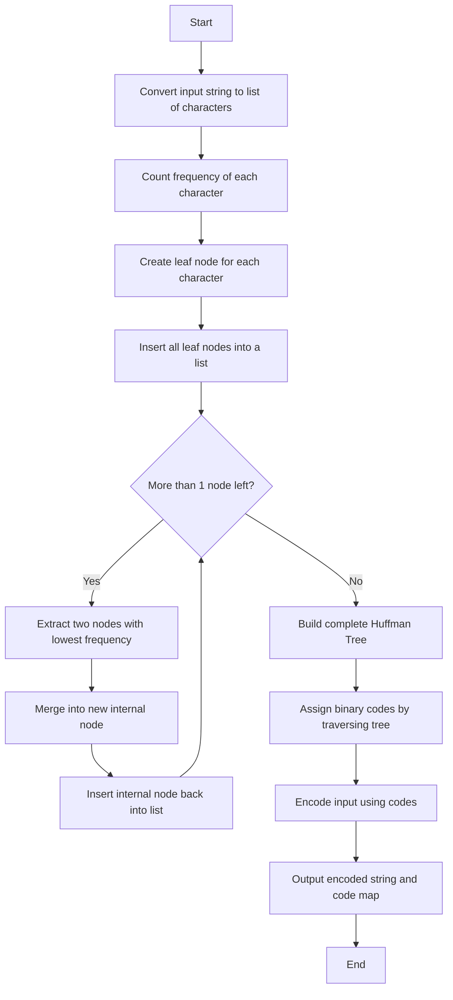
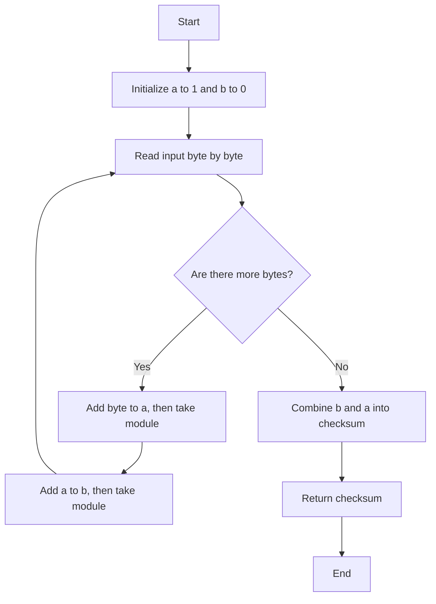

### Huffman Coding – Solution Strategy (Step-by-step)

1. Convert the input string to a list of characters.
2. Count the frequency of each character.
3. Create `Leaf` nodes for each unique character with their frequency.
4. Repeatedly:
   - Extract the two nodes with the lowest frequencies (from leaves or internals).
   - Merge them into an `InternalNode`.
   - Add the merged node back to the internal list.
5. Repeat until only one node remains → this becomes the root of the Huffman tree.
6. Traverse the tree to generate binary codes:
   - Left branch = `0`, right branch = `1`.
7. Encode the original text using the generated binary codes.
8. Decode by traversing the tree using the binary string until a `Leaf` is reached.

### Adler-32 Checksum – Solution Strategy (Step-by-step)

1. Initialize two accumulators the initial values of `a = 1` and `b = 0` are part of the algorithm's specification, and they serve specific purposes for correctness and historical reasons:
 - Why `a = 1` ?
    - Purpose: `a` starts at `1` so that the checksum of an empty string is not zero.
  Without this:
If `a` started at `0`, the checksum for an empty message would be `0` — which could cause confusion or bugs when validating empty input. This is similar to a "neutral" starting value, and ensures that any real data changes the checksum.

- Why `b = 0`?
   - Purpose:
`b` accumulates the values of `a`, so it must start at `0` to correctly reflect the sum of a values over time.`b` acts like a running total of partial checksums, building a second layer of integrity:
     - `a = 1`
     - `b = 0`
2. Convert the input text to bytes using UTF-8 encoding.
3. For each byte in the list:
   - Convert it to an unsigned integer: `byte & 0xff`
   - Add it to `a`, then: `a = a % 65521`
   - Add the new `a` to `b`, then: `b = b % 65521`
4. Combine the two 16-bit values into one 32-bit result:
   - `(b << 16) | a`
5. Return the result as the final checksum.

